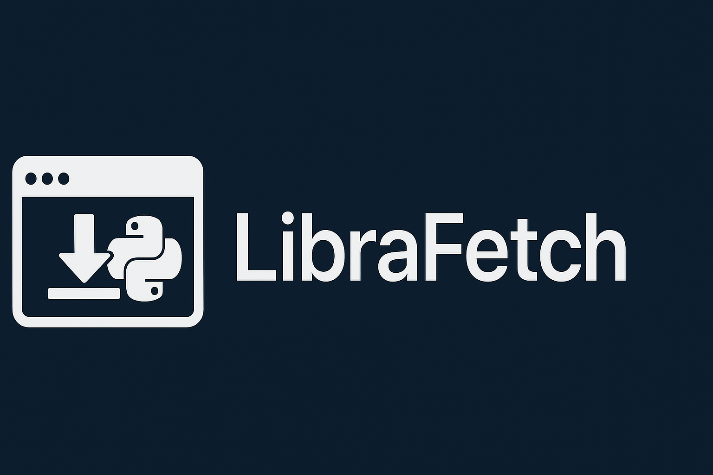

# LibraFetch

LibraFetch is a specialised web scraping tool to automatically acquire documents from a multitude of library catalogues, archives, and digital repositories. This purpose-built solution simplifies the process of retrieving academic papers, research reports, historical documents, and various types of files such as images from library systems, streamlining research and data collection.

## Features

- **Library Catalogue Compatibility**:
  Designed to seamlessly integrate with various library catalogues, regardless of their structure or indexing systems. It can navigate through search results or filter by categories to access collections for download.
- **Multi-Platform**:
  LibraFetch is compatible with a wide range of digital repositories, including [British Online Archives](https://microform.digital/boa/), [The British Library](https://www.bl.uk/), [WorldCat](https://www.worldcat.org/), [HathiTrust](https://www.hathitrust.org/), [Internet Archive](https://archive.org/), [Google Books](https://books.google.com/), [JSTOR](https://www.jstor.org/), [Project Gutenberg](https://www.gutenberg.org/), and many more.
- **Batch Downloading**:
  The tool supports batch downloading, allowing users to save multiple documents results simultaneously. This feature is especially valuable for researchers looking to compile extensive reading lists or archives.
- **Scheduled Updates**:
  Users can set up scheduled scraping tasks to keep their document collections up-to-date, particularly useful for staying informed about the latest research in a field of interest.
- **Authentication Support**:
  For library catalogues that require user authentication, the scraper can be configured to log in and access restricted content.
- **Precise Querying**:
  Users can specify search queries and filters, enabling the scraper to retrieve documents with pinpoint accuracy. Parameters such as keywords, publication dates, authors, and document types can be customized to match specific research requirements.
- **Batch Downloading**:
  LibraFetch supports batch downloading, allowing users to save multiple documents simultaneously. This feature is especially valuable for researchers looking to compile extensive reading lists or archives.
- **Robust PDF Handling**:
  The downloader can handle various download formats, including OCR-processed documents and scanned images, ensuring that all types of content are accessible.
- **Error Handling and Notifications**:
  The tool is equipped with error detection and handling mechanisms to address issues such as broken links, captcha challenges, or website changes. Users can set up notifications for exceptional cases.
- **Data Storage Options**:
  Downloaded PDF documents can be stored locally, organized in folders, or integrated with cloud storage solutions like Dropbox or Google Drive for easy access and backup.
- **Source Agnostic**:
  LibraFetch can retrieve documents from multiple sources simultaneously, allowing users to download documents from multiple library catalogues, archives, and digital repositories in one step.
- **Team Friendly**:
    LibraFetch supports multiple users, allowing teams to collaborate on document retrieval tasks.

## Use Cases:
1.	**Academic Research**: Researchers and students can use the downloader to access academic papers, journals, and theses from library databases, enhancing their study materials.
2.	**Historical Archives**: Historians and genealogists can retrieve historical records, manuscripts, and rare documents from digital library archives for research and preservation.
3.	**Professional Development**: Professionals in various fields can stay updated with the latest industry reports, research papers, and best practice documents.
4.	**Content Aggregation**: Content creators can gather reference material from library catalogues to create curated content for blogs, articles, or educational resources.

LibraFetch an indispensable tool for researchers, historians, educators, and content creators, streamlining the process of accessing and organizing valuable PDF documents from a wide range of library catalogues and digital repositories. Its efficiency, customization options, and ease of use make it an invaluable asset for anyone conducting research or seeking knowledge within the digital library landscape.

Implements [Selenium](https://www.seleniumhq.org/) for browser automation and [Beautiful Soup](https://www.crummy.com/software/BeautifulSoup/bs4/doc/) for parsing, sometimes takes advantage of pyautogui to simulate user mouse input to avoid weird javascript dynamic content.

---

## Setup

1. Install requirements using terminal:

```
pip install -r requirements.txt
```

2. Copy template.env to .env and fill in the required fields.
3. *(Maybe)* Install [ChromeDriver](https://sites.google.com/a/chromium.org/chromedriver/downloads).

4*(Optional)* [Configure environment variables paths](https://www.java.com/en/download/help/path.xml) for **python.exe** and **chromedriver.exe**.

---

## Running

Open terminal in the directory of **scrape.py** and enter:

```
python scrape.py
```

Open output folder to see whats been scraped.

---

## License

LibraFetch is distributed under the [MIT License](LICENSE).
